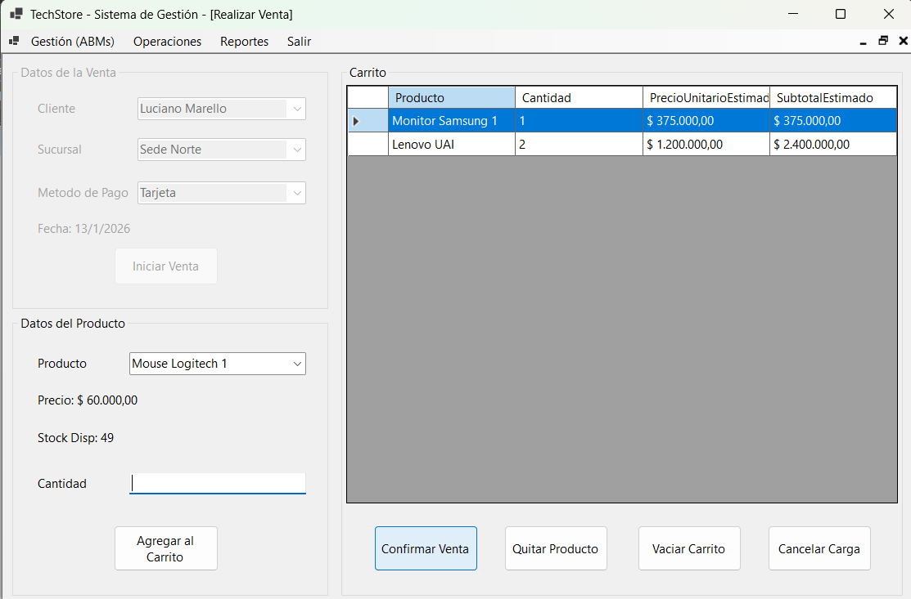

# 📦 Sistema de Gestión Comercial y Stock

Aplicación de escritorio robusta desarrollada en **C# .NET 8** diseñada para la administración integral de un comercio. El sistema gestiona el ciclo completo de compras, ventas, control de inventario y facturación, implementando una arquitectura escalable y buenas prácticas de ingeniería de software.

## 🚀 Características Técnicas Destacadas

Lo que hace diferente a este proyecto es su construcción bajo estándares profesionales:

* **Arquitectura en Capas (N-Tier):** Separación lógica estricta para facilitar el mantenimiento:
    * **Vista:** Interfaz de usuario (Windows Forms).
    * **Controladora:** Lógica de negocio y orquestación.
    * **Modelo:** Acceso a datos y Repositorios.
    * **Entidades:** Definición del dominio.
* **ORM Entity Framework Core:** Manejo de datos moderno utilizando *Code First* y Migraciones para el versionado de la base de datos.
* **Patrón Repository:** Abstracción de la capa de datos (`RepositorioProducto`, `RepositorioVenta`, etc.) para un código más limpio y testeable.
* **SQL Server:** Base de datos relacional robusta.

## 💻 Funcionalidades Principales

### 🛒 Gestión Comercial
* **Ventas y Compras:** Flujo completo de operación con cálculo de totales y actualización automática de stock.
* **Facturación:** Generación automática de tickets de venta en formato texto (`GeneradorFactura`).
* **Historiales:** Consultas detalladas de movimientos históricos de compras y ventas.

### 📦 Control de Inventario
* **Gestión de Lotes:** Trazabilidad de productos por lotes de ingreso.
* **Sistema de Alertas:** Notificaciones automáticas para reposición de stock crítico.
* **ABM Completo:** Administración de Productos, Rubros, Clientes, Proveedores y Sucursales.

## 🛠️ Stack Tecnológico

* **Lenguaje:** C#
* **Framework:** .NET 8.0 (Windows Forms)
* **Base de Datos:** Microsoft SQL Server
* **ORM:** Entity Framework Core
* **Herramientas:** Visual Studio 2022, Git.

## 📸 Capturas de Pantalla

| Panel Principal | Gestión de Ventas |
|:---:|:---:|
|  |  |
| *(Vista del dashboard general)* | *(Interfaz de carga de ventas)* |

## 🔧 Instalación y Puesta en Marcha

1.  **Clonar el repositorio:**
    ```bash
    git clone [https://github.com/LucianoMarello/TPF-Marello-Luciano.git](https://github.com/LucianoMarello/TPF-Marello-Luciano.git)
    ```
2.  **Base de Datos:**
    * El proyecto utiliza **Entity Framework Migrations**.
    * Abrir la consola del administrador de paquetes en Visual Studio.
    * Ejecutar: `Update-Database` (Esto creará automáticamente la DB y las tablas en tu SQL Server local).
3.  **Configuración:**
    * Verificar la `ConnectionString` en el archivo `App.config` o `Context.cs` para apuntar a tu instancia local de SQL Server.
4.  **Ejecución:**
    * Compilar y ejecutar la solución `TPF - Marello Luciano.sln`.

## 👤 Luciano Marello

**Luciano Marello**
* **LinkedIn:** [linkedin.com/in/luciano-marello](https://www.linkedin.com/in/luciano-marello/)
* **Email:** lucianomarello27@gmail.com

---
*Proyecto desarrollado aplicando conceptos avanzados de Programación Orientada a Objetos y Arquitectura de Software.*
